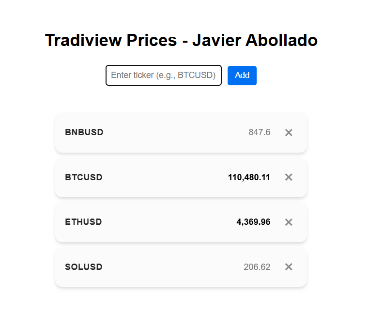

# Full Stack Tradingview Price Scraper

The application will consist of a Node.js backend and a Next.js frontend.



## Run

```{bash}
./run.sh
```

## Tech Stack

*   TypeScript
*   Next.js
*   Node.js
    *   `tsx` for TypeScript execution
*   `pnpm` for package management (do not use `npm`)
*   ConnectRPC for communication between the frontend and backend
*   Playwright to stream price data from TradingView via the Node.js server

## Data Streaming

*   Stream live cryptocurrency prices directly from TradingView using Playwright.
*   Target URLs follow the format: `https://www.tradingview.com/symbols/{ticker}/?exchange=BINANCE`.
    *   The `{ticker}` variable represents a valid cryptocurrency symbol (e.g., BTCUSD, ETHUSD, SOLUSD). A complete list of tickers is available at https://www.tradingview.com/markets/cryptocurrencies/prices-all/
    *   For implementation simplicity, the `exchange` is standardized to BINANCE.

# Key files

#### Frontend

 - `frontend/src/pages/index.tsx`: runs frontend.
 - `frontend/src/pages/ticker_prices.tsx`: main blocks to render the tickers and prices.

#### Backend

 - `backend/src/index.ts`: runs backend.
 - `backend/src/server.ts`: runs playwright server to get prices and handles prices updates.


# Key Architectural Concepts

#### 1. Decoupling Web Scraping and Broadcasting
Instead of scraping a web page for every single user request, the server centralizes the data fetching process. A single, scheduled background task handles all web scraping. This prevents redundant, resource-intensive scraping calls and significantly reduces latency.

#### 2. The Publish-Subscribe Pattern
The application architecture is built on a Pub/Sub model. 
* **Publisher:** The server's scraping logic acts as a publisher. It periodically fetches prices from TradingView and publishes them to a centralized cache.
* **Subscribers:** Each user's front-end client acts as a subscriber. When a user adds a ticker, their client subscribes to that specific data stream on the server.
* **Event-Driven Updates:** The backend maintains a list of subscriptions. When a price changes in the cache, the server broadcasts the update only to the clients who have subscribed to that specific ticker.

#### 3. Efficient Resource Management
The system is designed for concurrency and minimal overhead.
* **Playwright Pages:** A single Playwright browser is launched for the entire server. Instead of navigating one page sequentially, the server creates a new, dedicated Playwright page for each ticker being watched by at least one user. This is crucial for performance, as it allows all scraping tasks to run in **parallel**, reducing the scrape time from several seconds per ticker to a fraction of that.
* **WebSocket Communication:** WebSockets provide a persistent, two-way connection between the frontend and backend. This enables the server to push real-time price updates to the clients as they become available, eliminating the need for inefficient HTTP polling.

### Workflow and Benefits

1.  A user adds a ticker from the frontend, which sends a `addTicker` message to the backend with their unique user ID.
2.  The backend's `addTicker` function adds the ticker to the `tickersToWatch` list and adds the user to the `tickerSubscriptions` list. If it's a new ticker, a new Playwright page is launched to begin scraping its data.
3.  The `scrapTicker` function runs continuously, scraping its dedicated page at regular intervals.
4.  When a price change is detected, it updates the central `priceCache` and calls `broadcastPriceUpdate`.
5.  `broadcastPriceUpdate` iterates through the list of users subscribed to that specific ticker and sends the new price via their WebSocket connection, ensuring minimal data is sent over the network and only to relevant clients.
6.  When a user removes a ticker, the backend removes their subscription. If no other users are watching that ticker, the dedicated Playwright page is closed and all resources are released.

This architecture ensures a highly scalable system that can handle many concurrent users and tickers without a proportional increase in resource consumption. The separation of concerns and the Pub/Sub pattern are key to its efficiency and responsiveness.

